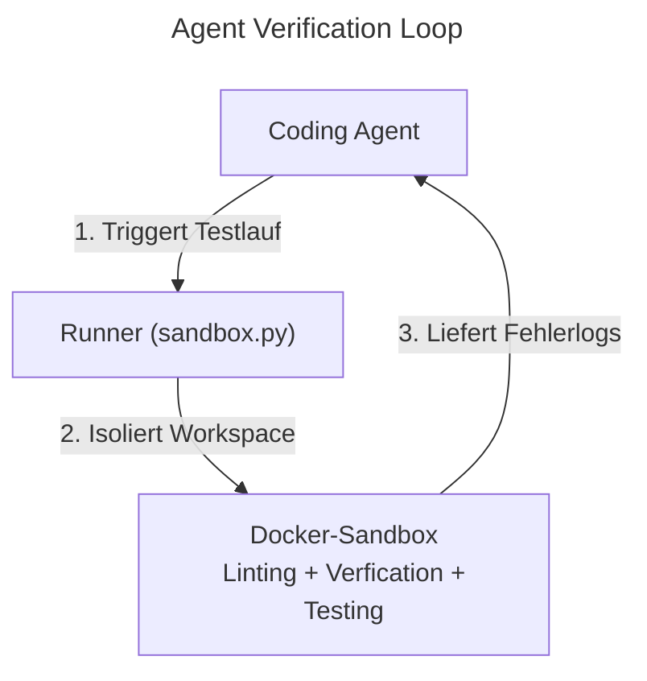
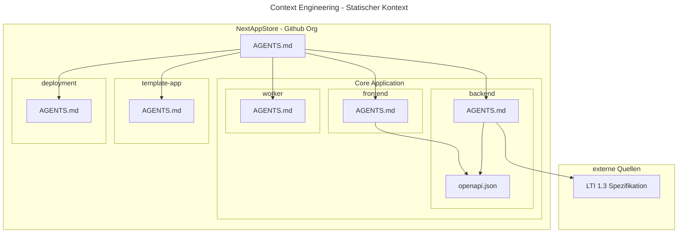

# NextAppStore Verification Harness

This harness provides an isolated, reproducible Docker sandbox for running linters, database migrations, tests, and agent-generated commands without risking host machine pollution.

## Architecture

- **`Dockerfile.sandbox`**: Container image definition with Ubuntu 24.04, Python venv, Poetry, PostgreSQL, Terraform, and Shellcheck.
- **`verify.sh`**: The verification script that boots Postgres, seeds the test database, runs `ruff`, validates templates, and executes `pytest`.
- **`sandbox.py`**: The Python sandbox runner and programmatic SDK (`run_in_sandbox`).
- **`run.sh`**: Quick bash CLI wrapper.

---

## How to Use

### 1. Command Line (Developers & Agents)

From anywhere in the repository root:

```bash
# 1. Fast verification (Linting + Unit tests)
python3 agentic-harness/sandbox.py --fast
# Or via bash wrapper:
./agentic-harness/run.sh --fast

# 2. Full verification (Linting + Integration + Unit tests)
python3 agentic-harness/sandbox.py --full

# 3. Ephemeral mode (Copies repo to isolated tempdir, guarantees zero host pollution)
python3 agentic-harness/sandbox.py --ephemeral --fast

# 4. Run any custom command inside the container
python3 agentic-harness/sandbox.py pytest backend/tests/unit/test_models.py
python3 agentic-harness/sandbox.py ruff check backend/

# 5. Force rebuild the sandbox image
python3 agentic-harness/sandbox.py --rebuild
```

---

### 2. Programmatic Python SDK (Agent Loops & Eval Scripts)

You can import `run_in_sandbox` directly in agent workflows or benchmark scripts:

```python
from sandbox import run_in_sandbox

# Execute a test run
result = run_in_sandbox(
    command="bash agentic-harness/verify.sh fast",
    timeout=180,
    ephemeral=True,  # Protect host workspace
)

if result.success:
    print("Verification succeeded!")
else:
    print(f"Failed with exit code {result.exit_code}")
    print("STDOUT:", result.stdout)
    print("STDERR:", result.stderr)
    # Feed result.stderr / result.stdout back to the LLM for self-correction
```

### Docs for the Presentation





### Notes

- MCP Server refernziern
